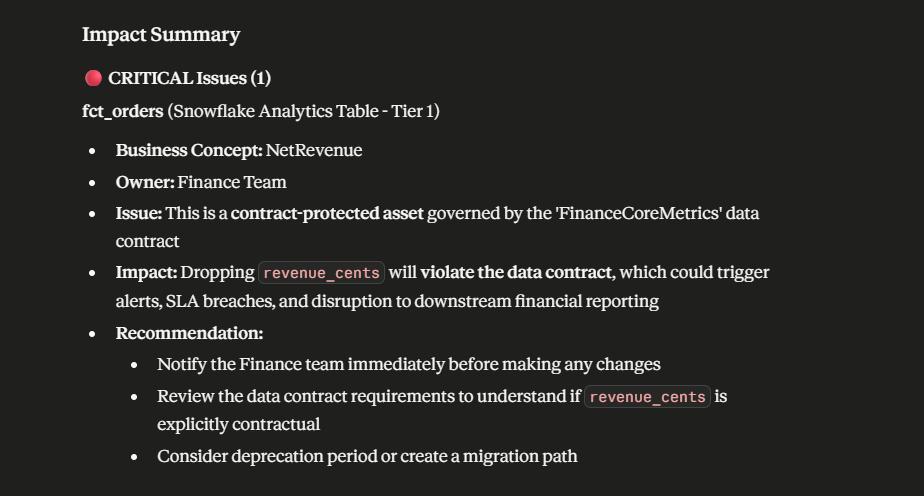

# LineageGuard

A deterministic semantic blast radius analyzer for OpenMetadata.



## The Problem

A data engineer renames `revenue_cents` to `revenue_cents_usd` in a core dbt model. The CI pipeline passes because the SQL compiles. The pull request merges. Two hours later, the CFO's mission-critical Metabase dashboard goes dark. Data teams rely heavily on schema validation and compiler checks, but these tools lack semantic awareness of the downstream blast radius.

Existing lineage graphs show what connects to what, but human operators must manually trace the graph, contact owners, and negotiate downtime. As data ecosystems grow, this manual translation of technical changes into business impact fails to scale, leading to broken contracts and lost trust.

## The Solution

LineageGuard evaluates schema changes before they merge by walking the OpenMetadata lineage graph and applying deterministic governance signals. It treats metadata as deterministic code, not abstract documentation.

Given a simulated schema change, the engine traverses downstream dependencies to evaluate ownership, tiering, glossary terms, and data contracts. It ranks each affected entity using a strict classification algorithm, outputting structured JSON. This isolates the reasoning in the deterministic engine, allowing an LLM to accurately narrate the business impact without hallucinating severities or inventing dependencies.

## Architecture

```text
+-------------------+      +------------------+      +---------------------------+      +--------------+
|                   |      |                  |      | Engine                    |      |              |
|  Claude Desktop   |<---->|    MCP Server    |<---->| (Lineage + Governance    |<---->| OpenMetadata   |
|  (Narrator)       | stdio|  (JSON-RPC API)  | pure |        + Ranker)          | REST | (Local Server) |
|                   |      |                  | call |                           |      |              |
+-------------------+      +------------------+      +---------------------------+      +--------------+
```

## Quick Start

```bash
git clone https://github.com/coded-devs/lineageguard.git
cd lineageguard
docker compose up -d
# Wait for containers to report 'healthy'
# Generate a Personal Access Token (PAT) in the OpenMetadata UI
# Create .env with OPENMETADATA_URL and OPENMETADATA_TOKEN
pip install -e .
python seed.py
lineageguard analyze -t Stripe.stripe_db.public.raw_stripe_data --drop-column revenue_cents
```

## Using with Claude Desktop

LineageGuard exposes a Model Context Protocol (MCP) server. To connect it to your local Claude Desktop installation, refer to [docs/MCP_SETUP.md](docs/MCP_SETUP.md).

## The Semantic Ranker

| Severity | Criteria                                                            |
| -------- | ------------------------------------------------------------------- |
| CRITICAL | Tier 1 asset OR active contract violation OR critical glossary term |
| HIGH     | Tier 2 asset OR important glossary term                             |
| WARNING  | Tier 3 asset                                                        |
| INFO     | Untiered asset with no significant governance signals               |

## Design Principle

From the system specifications:

> **The engine is deterministic. The LLM is only a narrator.**
>
> All severity classification, lineage traversal, and impact decisions happen in pure Python code — no LLM calls inside the engine. LLMs (Claude, etc.) only consume the structured JSON output and translate it into human-readable explanations.

## Example Output

```markdown
# LineageGuard — Semantic Blast Radius Report

**Source entity:** `Stripe.stripe_db.public.raw_stripe_data`
**Analysis time:** 2026-04-20T05:09:37Z

## Summary

- 🔴 CRITICAL: 1
- 🟠 HIGH: 2
- 🟡 WARNING: 1
- 🔵 INFO: 1

## Findings

### 🔴 CRITICAL — fct_orders (depth 2)

**Business concept:** NetRevenue
**Tier:** Tier1
**Owner:** Finance
**Contract violated:** yes

> Contract-protected asset: Data Contract 'FinanceCoreMetrics' on fct_orders.

---

### 🟠 HIGH — dim_customers (depth 1)

**Business concept:** Customer
**Tier:** Tier2
**Contract violated:** no

> Tier 2 asset backing business concept Customer.

---

### 🟠 HIGH — executive_revenue_dashboard (depth 3)

**Tier:** Tier1
**Contract violated:** no

> Tier 1 asset with no additional governance — still business-critical.

---

### 🟡 WARNING — marketing_attribution_dashboard (depth 3)

**Tier:** Tier3
**Contract violated:** no

> Tier 3 asset — lower priority but worth flagging.

---

### 🔵 INFO — stg_stripe_charges (depth 1)

**Contract violated:** no

> No semantic governance attached.
```

## What's NOT in this MVP

- CI/CD integrations (e.g. GitHub Actions)
- Automated write-backs to OpenMetadata
- Parsing raw SQL or dbt manifests
- Real-time Slack notifications
- Database credential management

## Project Structure

```text
lineageguard/
├── .env.example
├── docker-compose.yml
├── pyproject.toml
├── seed.py
├── docs/
│   └── MCP_SETUP.md
├── examples/
│   ├── sample_change_spec.json
│   ├── sample_output.json
│   └── sample_output.md
└── src/
    └── lineageguard/
        ├── cli.py
        ├── client.py
        ├── engine.py
        ├── formatter.py
        ├── governance.py
        ├── lineage.py
        ├── mcp_server.py
        ├── models.py
        └── ranker.py
```

## License

MIT
